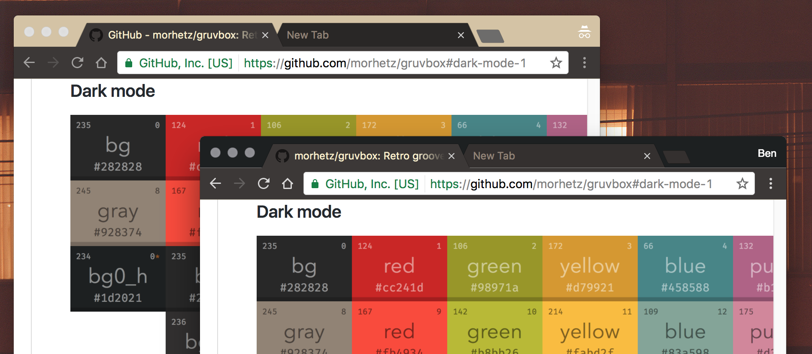

# gruvbox-chrome-theme
Port of the gruvbox retro groove color scheme for Chrome

The original Vim theme can be found here: https://github.com/morhetz/gruvbox

## Installation

Install via the Chrome Webstore: [gruvbox theme](https://chrome.google.com/webstore/detail/gruvbox-theme/ihennfdbghdiflogeancnalflhgmanop)

## Screenshots

## Contributing
Issues/PRs are much appreciated!

Feature requests/improvements welcome.

## License
This project is licensed under the [MIT License](LICENSE).
